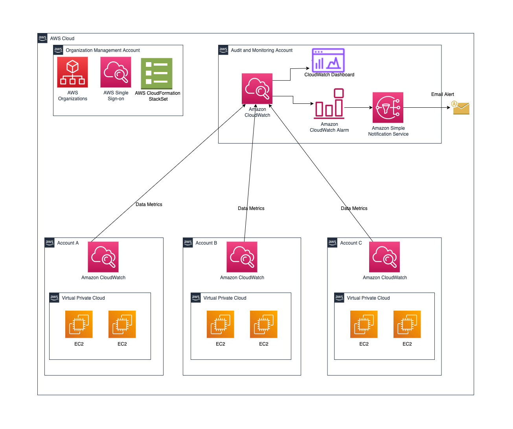

## AWS Multi-Account EC2 Disk Monitoring Solution With Ansible

 Automated disk utilization monitoring across AWS Organizations using Ansible with centralized S3 reporting

##  Solution Overview

This automation framework enables comprehensive disk monitoring across multiple AWS accounts within an Organization. The solution leverages Ansible for orchestration and provides centralized reporting through S3 storage.

**Core Capabilities:**
- Monitor EC2 disk utilization across multiple AWS accounts and regions
- Generate automated CSV reports with comprehensive disk metrics
- Centralized data storage in S3 for analysis and reporting
- Dynamic inventory management with minimal configuration changes

## Architecture & Design

We've developed two robust approaches to monitor disk utilization across AWS multi-account environment in AWS Organization.

### First Implementation Approach: Ansible-Based Direct Monitoring

Our solution implements a three-tier architecture:

**Tier 1: Account Configuration**
- AWS profile setup via `Account_profiles.yml`
- Multi-account credential management

**Tier 2: Data Collection**
- Disk metrics gathering through `disk-metrics.yml`
- Real-time EC2 instance monitoring

**Tier 3: Dynamic Management**
- Auto-generated inventory systems
- Scalable account integration


### Network Architecture Components

| Component | Purpose | Location |
|-----------|---------|----------|
| Ansible Controller | Central orchestration | Central AWS Account |
| EC2 Instances | Monitoring targets | Child AWS Accounts |
| S3 Storage | Report repository | Central AWS Account |
| Transit Gateway | Inter-account connectivity | Hub-Spoke topology |
| IAM Roles | Cross-account access | All accounts |

## Key Features

### Security & Access Management
- **Cross-Account IAM Roles**: Secure access via AWS STS AssumeRole
- **Identity Center Integration**: Centralized access management
- **Organizations Support**: Native AWS Organizations integration

### Dynamic Operations
- **Expandable Inventory**: Automatic account discovery and integration
- **Real-time Reporting**: Current state-based report generation
- **Flexible Configuration**: Minimal setup for new account additions

###  Network & Connectivity
- **Port Requirements**: SSH (22) and HTTPS (443) access
- **Transit Gateway**: Hub-spoke communication model
- **Multi-region Support**: Cross-region monitoring capabilities

##  Prerequisites & Requirements

### Infrastructure Requirements

**Central Account Setup:**
- EC2 instance with appropriate instance profile
- S3 bucket for report storage
- Transit Gateway connectivity

**Target Account Requirements:**
- EC2 instances tagged with `Monitoring: yes`
- Cross-account IAM roles deployed
- Network connectivity via Transit Gateway

### Software Dependencies

```bash
# Required Software Versions
Ansible: 2.9+
AWS CLI: Latest version
Python: 3.6+
```

### AWS Permissions Framework

#### Controller Instance Permissions
The Ansible controller requires these IAM permissions:

```json
{
  "Version": "2012-10-17",
  "Statement": [
    {
      "Effect": "Allow",
      "Action": [
        "organizations:ListAccountsForParent",
        "ec2:DescribeInstances",
        "s3:PutObject",
        "sts:AssumeRole"
      ],
      "Resource": "*"
    }
  ]
}
```

*Complete policy available in `ansible-controller-policy.json`*

## Installation & Setup

### Phase 1: Ansible Installation

Choose your preferred installation method:

**Ubuntu/Debian Systems:**
```bash
sudo apt update && sudo apt install ansible
```

**RHEL/CentOS/Amazon Linux:**
```bash
sudo yum install ansible
```

**Python Package Manager (Recommended):**
```bash
python3 -m pip install ansible
```

### Phase 2: Cross-Account Role Deployment

Deploy IAM roles across your organization using CloudFormation StackSets:

```bash
# Create the StackSet
aws cloudformation create-stack-set \
  --stack-set-name ansible-collector-roles \
  --template-body file://ansible-role.yml \
  --parameters ParameterKey=CentralAccountId,ParameterValue=123456789012 \
  --capabilities CAPABILITY_NAMED_IAM

# Deploy across Organization
aws cloudformation create-stack-instances \
  --stack-set-name ansible-collector-roles \
  --deployment-targets OrganizationalUnitIds=ou-ho27-9do7jpuw \
  --regions ap-south-1
```

### Phase 3: Project Setup

```bash
# Clone repository
git clone <repository-url>
cd <repository-name>

# Install Ansible collections
ansible-galaxy collection install -r requirements.yml

# Configure SSH key permissions
chmod 400 ansible.pem
```

## Configuration Management

### Global Configuration (`group_vars/all.yaml`)

```yaml
# Authentication Settings
ansible_ssh_private_key_file: ansible.pem
ansible_ssh_user: ubuntu

# Organization Structure
ou_ids:
  - ou-abc123-4wfiba56

# Regional Configuration
regions:
  - us-east-1
  - ap-south-1
  - ap-southeast-1

# Role Configuration
role_name: central_ansible_collector
aws_config_path: "~/.aws/config"

# Storage Configuration
s3_bucket_name: "my-ec2-disk-reports"
s3_report_path: "disk_utilization_reports/"
local_report_path: "/tmp/disk_utilization_report.csv"
```

## Execution Workflow

### Step 1: Account Profile Generation

Initialize AWS profiles for organizational accounts:

```bash
ansible-playbook Account_profiles.yml
```

**Process Flow:**
1. Query AWS Organizations API
2. Generate AWS CLI profiles
3. Create dynamic inventory files
4. Generate account variables

### Step 2: Disk Monitoring Execution

Execute comprehensive disk monitoring:

```bash
ansible-playbook disk-metrics.yml -i inventory/
```

**Execution Steps:**
1. Initialize CSV report structure
2. Collect disk metrics from tagged instances
3. Aggregate data into unified report
4. Upload to S3 storage
5. Cleanup temporary files

### Targeted Account Monitoring

For specific account monitoring:

```bash
ansible-playbook disk-metrics.yml -i inventory/<account-name>_<region>_aws_ec2.yml
```

## Report Structure & Output

### CSV Report Schema

| Field | Data Type | Description |
|-------|-----------|-------------|
| Account ID | String | AWS Account Identifier |
| Region | String | AWS Region Code |
| Instance ID | String | EC2 Instance Identifier |
| Device Name | String | Storage Device Path |
| Total Size | String | Complete Storage Capacity |
| Used Size | String | Consumed Storage Space |
| Remaining Size | String | Available Storage Space |
| Disk Use % | String | Utilization Percentage |

## Project Structure

```
project-root/
│
├── :page_facing_up: Playbooks
│   ├── Account_profiles.yml                    # Account setup automation
│   └── disk-metrics.yml                # Monitoring orchestration
│
├── :cloud: AWS Resources
│   ├── ansible-role.yml                # CloudFormation template
│   └── ansible-controller-policy.json  # IAM policy definition
│
├── :closed_lock_with_key: Authentication
│   └── ansible.pem                     # SSH private key
│
├── :package: Dependencies
│   └── requirements.yml                # Ansible collections
│
├── :frame_with_picture: Documentation
│   ├── architecture-diagram.drawio     # Diagram source
│   └── images/
│       ├── architecture-diagram.png
│       ├── architecture-diagram-option2.png
│       └── architecture-diagram-option3.png
│
├── :gear: Configuration
│   └── group_vars/
│       └── all.yaml                    # Global variables
│
├── :clipboard: Dynamic Content
│   ├── inventory/                      # Auto-generated inventories
│   │   └── <account>_aws_ec2.yml
│   └── vars/
│       └── account_vars.yml            # Account variables
│
└── :book: README.md
```

### SSH Key Configuration

**Setup Requirements:**
1. Place your EC2 SSH private key as `ansible.pem` in project root
2. Apply secure permissions: `chmod 400 ansible.pem`
3. Ensure key corresponds to EC2 instance key pairs
4. Update `ansible_ssh_private_key_file` in configuration if using different key name

## Advanced Configuration

### Custom SSH Key Management

If using alternative key names, modify the configuration:

```yaml
# In group_vars/all.yaml
ansible_ssh_private_key_file: /path/to/your/custom-key.pem
```

### Multi-Region Deployment

Extend regional coverage by updating the regions list:

```yaml
regions:
  - us-east-1
  - us-west-2
  - eu-west-1
  - ap-south-1
```

---

*This solution provides enterprise-grade disk monitoring capabilities with minimal operational overhead and maximum scalability.*

### Option 2: CloudWatch Cross-Account Observability

This solution utilizes Amazon CloudWatch's cross-account observability features for comprehensive disk utilization monitoring:

1. **CloudWatch Agent** - Deployed across EC2 instances to gather disk usage data
2. **Cross-Account Observability** - Centralizes metric collection from distributed AWS accounts
3. **Dashboards & Alerting** - Delivers visual monitoring and automated threshold notifications
4. **SNS Integration** - Distributes alerts when disk usage exceeds defined limits

#### Architecture Diagram - Approach 2



Core architectural elements:

- **Monitoring Hub Account**: Houses centralized dashboards, alarm configurations, and notification services
- **Distributed Source Accounts**: Host EC2 instances equipped with CloudWatch Agent
- **StackSets Deployment**: Orchestrates cross-account configuration deployment at enterprise scale
- **Notification Infrastructure**: Manages email alerts when storage thresholds trigger

## Implementation Framework

### Cross-Account Observability Foundation

This CloudWatch-driven approach establishes a unified monitoring ecosystem through cross-account observability:

- **Consolidated Telemetry**: Aggregate and analyze metrics, logs, and traces from multiple AWS accounts within a single monitoring hub
- **Multi-Account Visualization**: Build comprehensive dashboards displaying cross-account metrics in unified views
- **Distributed Alarm Management**: Deploy alarms that monitor metrics across account boundaries
- **Accelerated Issue Resolution**: Enable rapid log searching and correlation across distributed applications

### Deployment Workflow

1. **Establish Monitoring Hub**
   Configure a dedicated AWS account to serve as the central observability platform

2. **Orchestrate Cross-Account Setup**
   Deploy CloudFormation StackSets organization-wide to establish:
   - Cross-account IAM roles enabling monitoring hub access
   - Standardized CloudWatch Agent deployment configurations
   - Metric sharing authorization frameworks

3. **Deploy Monitoring Agents**
   - Roll out CloudWatch agents to target EC2 instances
   - Configure agents for disk utilization metric collection
   - Establish optimal data collection frequencies

4. **Configure Observability Links**
   - Create observation connections in the monitoring hub using Organization or OU identifiers
   - Enable automatic inclusion of current and future organizational accounts

5. **Build Visualization Layer**
   - Construct dashboards showcasing cross-account disk utilization patterns
   - Implement filtering capabilities by account, region, and instance classifications

6. **Implement Alerting Framework**
   - Deploy multi-tier alarms for various criticality levels (warning, critical)
   - Establish alarm-to-notification routing via SNS integration

7. **Configure Notification Services**
   - Establish SNS topics segmented by alert severity
   - Configure email subscription endpoints for alert delivery
   - Integrate with external ticketing platforms as needed

### Enterprise Scaling Strategy

The architecture automatically accommodates organizational growth through AWS Organizations integration:

- Newly provisioned accounts inherit monitoring capabilities automatically
- StackSets ensure consistent IAM role and configuration deployment to emerging accounts
- Agent installation automation leverages Systems Manager or Ansible for streamlined deployment

### Ansible Integration Opportunities

CloudWatch serves as the primary monitoring backbone while Ansible enhances operational capabilities:

- Orchestrate CloudWatch Agent deployment across multi-account environments
- Extract CloudWatch metrics for specialized reporting requirements
- Execute automated remediation workflows triggered by CloudWatch alarm states

### Solution Advantages

- **Continuous Monitoring**: Real-time disk utilization tracking with minimal latency
- **Centralized Visibility**: Unified dashboard perspective across entire AWS estate
- - **Preventive Alerting**: Early warning notifications before critical storage depletion
- **Automatic Scaling**: Seamless integration of new accounts through Organizations framework

